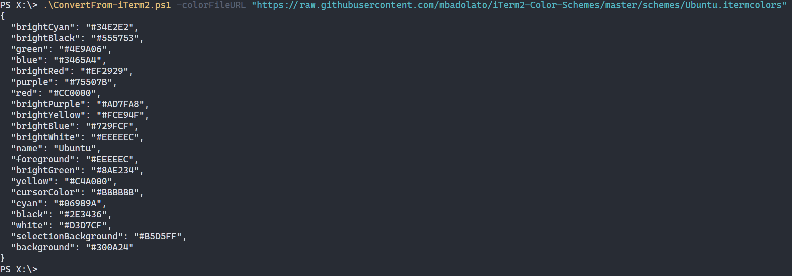
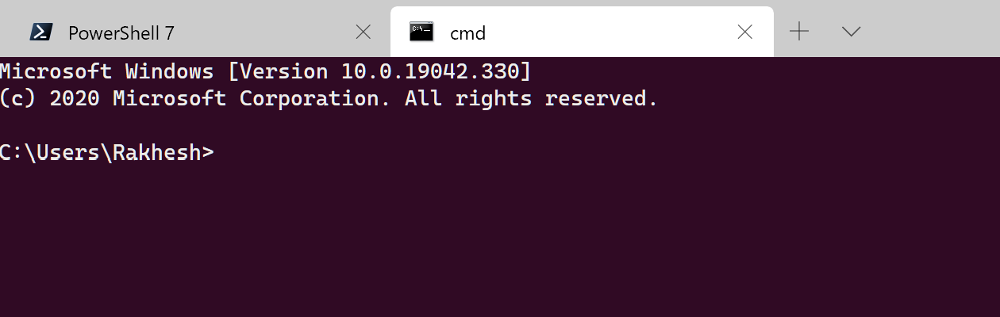

# iTerm2 Colors to Windows Terminal colors

The `ConvertFrom-iTerm2.ps1` script takes an iTerm2 color scheme and outputs JSON you can put into a Windows Terminal color scheme. You either specify an http(s) URL to an `itermcolors` file which it will download and output JSON, or pass it an already downloaded file. In case of the former use the `-ConfigFileURL` switch, in case of the latter use the `-ConfigFile` switch.

You can find iTerm2 color schemes [here](https://iterm2colorschemes.com) for instance.

Example:

The above pulls the Ubuntu colour theme, which I can input into Windows Terminal to get something like this:

See [this blog post](https://rakhesh.com/powershell/converting-iterm2-colours-to-windows-terminal-colors/) for the background on this.

Tested with PowerShell 7/ PowerShell Core so it works on Linux & macOS.
